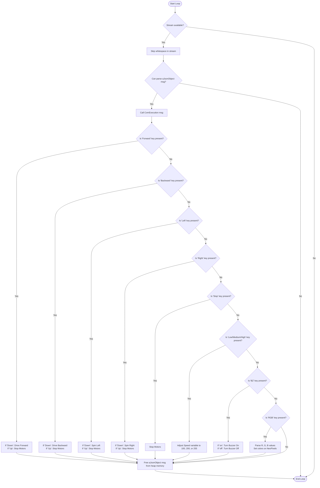

# Bluetooth Control with JSON Parsing (`Bluetooth-json`)

This program allows you to remote control the AlphaBot2 using structured JSON packets sent over a Bluetooth Low Energy (BLE) link. It utilizes the `aJSON` library to parse command streams in real-time.

Additionally, a custom web-based dashboard is provided at the workspace root to control the robot directly from your browser.

---

## 🔌 Jumper Wire Connections (For 6-pin BLE Module V2.0)

Connect your BLE module directly to the Arduino headers on the AlphaBot2 chassis:

| BLE Module Pin | Connection Destination | Function |
| :--- | :--- | :--- |
| **`VCC`** | **`5V`** (or **`3.3V`**) | Power Supply (3.6V–6V compatible) |
| **`GND`** | **`GND`** | Ground Reference |
| **`TXD`** | **`Pin 0 (RX)`** | Data Transmitted from BLE to Arduino |
| **`RXD`** | **`Pin 1 (TX)`** | Data Received by BLE from Arduino |
| **`STATE` / `EN`** | *Leave Disconnected* | Not required for serial control |

> [!CAUTION]
> **⚠️ UPLOAD WARNING (CRITICAL)**:
> You **MUST unplug the TXD and RXD wires (Pin 0 and Pin 1) from the Arduino before uploading/flashing the sketch**. 
> Attempting to flash the board while the BLE module is active will block the programmer and cause upload errors. Reconnect them once flashing is successful.

---

## 📡 Web Bluetooth Controller Dashboard
Instead of installing proprietary controller apps, open the premium Web BLE interface built for this bot:
*   **Location**: [bluetooth_controller.html](file:///f:/AlphaBot2/bluetooth_controller.html) (in the workspace root)
*   **Web Deployment**: Accessible over HTTPS via GitHub Pages (e.g. `https://cokaine29.github.io/AlphaBot2/bluetooth_controller.html`)
*   **Features**: Tactile D-pad, keyboard shortcuts (W, A, S, D), Horn toggle, speed tabs, and a real-time RGB color picker.

---

## 📊 JSON Command Schema

The sketch parses incoming JSON strings and triggers the following reactions:

### 1. Steering & Driving
Driving commands are momentary. The robot drives when a key is pressed (`"Down"`) and stops when it is released (`"Up"`).
*   **Forward**: `{"Forward": "Down"}` to drive forward; `{"Forward": "Up"}` to stop.
*   **Backward**: `{"Backward": "Down"}` to drive backward; `{"Backward": "Up"}` to stop.
*   **Left Turn**: `{"Left": "Down"}` to spin left; `{"Left": "Up"}` to stop.
*   **Right Turn**: `{"Right": "Down"}` to spin right; `{"Right": "Up"}` to stop.
*   **Global Stop**: `{"Stop": "Down"}` halts both motors instantly.

### 2. Speed Configuration
*   **Low Speed (100)**: `{"Low": "Down"}`
*   **Medium Speed (200)**: `{"Medium": "Down"}`
*   **High Speed (255)**: `{"High": "Down"}`

### 3. Buzzer (Horn)
*   **Buzzer On**: `{"BZ": "on"}`
*   **Buzzer Off**: `{"BZ": "off"}`

### 4. RGB Headlights
Set custom solid hex-RGB lighting on all 4 LEDs by sending a string containing color coordinates:
*   **Red**: `{"RGB": "255,0,0"}`
*   **Cyan**: `{"RGB": "0,255,255"}`
*   **Yellow**: `{"RGB": "255,230,0"}`

---

## 📊 Flowchart



---

## 🔍 How the Code Works

1.  **JSON Stream Parsing**:
    An instance of `aJsonStream` is connected directly to the hardware `Serial` interface:
    ```cpp
    aJsonStream serial_stream(&Serial);
    ```
    In `loop()`, the incoming stream is checked. `serial_stream.skip()` discards delimiters and whitespace. The `aJson.parse(&serial_stream)` command reads the raw JSON characters, parses them into a structured key-value tree (`aJsonObject`) in dynamic memory, and hands it to `ComExecution()`.
2.  **Command Extraction**:
    Inside `ComExecution()`, the code queries the parsed object tree for specific keys using:
    ```cpp
    aJsonObject *Forward = aJson.getObjectItem(msg, "Forward");
    ```
    If the key is found, the value string is compared to trigger actions. For instance, if the value is `"Down"`, the motors drive; if `"Up"`, they stop.
3.  **Memory Management**:
    Because JSON parsing dynamically allocates blocks of RAM on the heap (which only has 2KB total on the ATmega328P), it is critical that we free this memory as soon as execution completes:
    ```cpp
    aJson.deleteItem(msg);
    ```
4.  **Buzzer Control (PCF8574)**:
    Since the buzzer is wired to Pin P5 of the PCF8574 I2C I/O expander, turning the buzzer on and off requires I2C writes:
    *   `beep_on` writes to the expander while masking out bit 5 (making it `0`/LOW to trigger the buzzer's active-low circuit).
    *   `beep_off` writes to the expander and sets bit 5 back to `1`/HIGH.

---

## 🛠️ Compatibility & Bug Fixes Applied

To compile this official sketch and run it properly, the following modifications were made:
1.  **aJSON Library Compiler Patch**:
    *   **Problem**: Modern Arduino AVR cores declare `virtual void Print::flush()` as returning `void`. The default `aJSON` library declared `int aJsonStream::flush()`, resulting in compilation conflicts.
    *   **Fix**: Modified the return type of `aJsonStream::flush()` to `void` in both [aJSON.h](file:///f:/AlphaBot2/Arduino/libraries/aJSON/aJSON.h#L91) and [aJSON.cpp](file:///f:/AlphaBot2/Arduino/libraries/aJSON/aJSON.cpp#L504).
2.  **Motor Configuration Bug**:
    *   **Problem**: The setup function had a duplicate pinMode routine that re-initialized `AIN1/AIN2` and left `BIN1/BIN2` (right motor direction pins) unconfigured.
    *   **Fix**: Repaired setup to properly set outputs for `BIN1` and `BIN2`.
3.  **Baud Rate Adjustment**:
    *   Set the Serial interface speed to `9600` baud in `setup()`, matching the standard default factory speed of generic BLE modules (e.g. HM-10).
4.  **Wheel Imbalance Calibration**:
    *   Added `LEFT_SPEED_OFFSET` (`0`) and `RIGHT_SPEED_OFFSET` (`-3`) calibrations to standard forward and backward driving functions to ensure the robot travels in a straight line.
