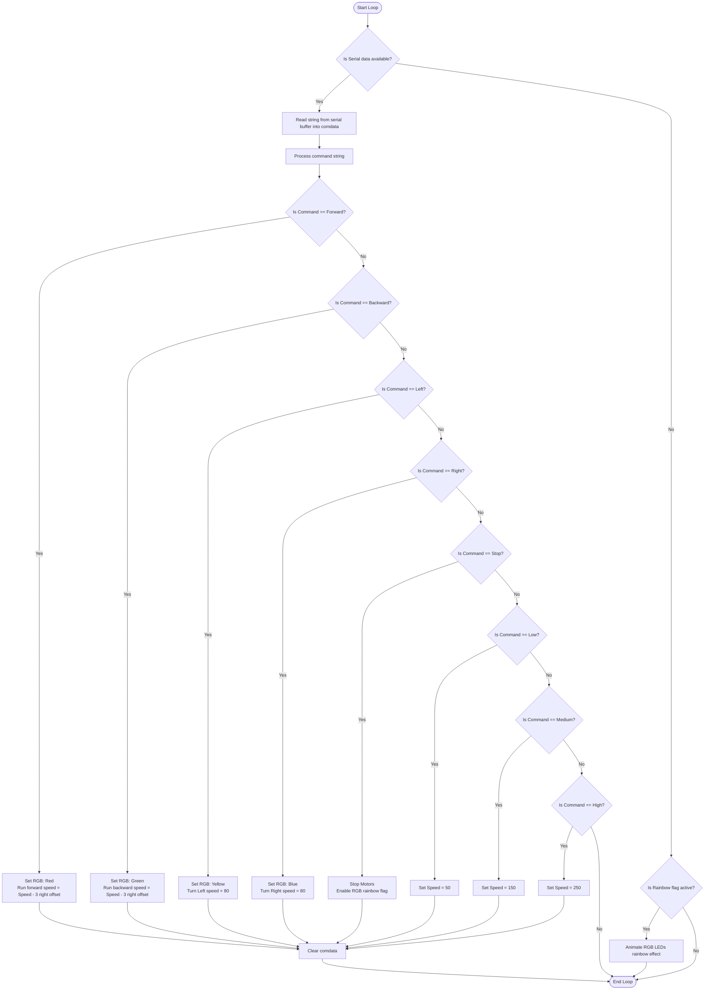

# Control the Car By Bluetooth (`Bluetooth`)

This program allows you to remote control the AlphaBot2 using a Bluetooth or BLE module via a smartphone app. 

---

## 🔌 Jumper Wire Connections (For 6-pin BLE Module V2.0)

Since you are using a standard 6-pin BLE module (like an HM-10, AT-09, or JDY-31) instead of the XBee board module, you can connect it directly to the exposed Arduino header sockets using standard female-to-male jumper wires:

| BLE Module Pin | Connection Destination | Function |
| :--- | :--- | :--- |
| **`VCC`** | **`5V`** (or **`3.3V`**) | Power Supply (3.6V–6V compatible) |
| **`GND`** | **`GND`** | Ground Reference |
| **`TXD`** | **`Pin 0 (RX)`** | Data Transmitted from BLE to Arduino |
| **`RXD`** | **`Pin 1 (TX)`** | Data Received by BLE from Arduino |
| **`STATE` / `EN`** | *Leave Disconnected* | Not required for serial control |

> [!CAUTION]
> **⚠️ UPLOAD WARNING (CRITICAL)**:
> You **MUST unplug the TXD and RXD wires (Pin 0 and Pin 1) from the Arduino before uploading/flashing the sketch**. 
> 
> Because the Arduino's programmer shares Pins 0 and 1 with the USB serial port, attempting to upload while the BLE module is connected will fail with upload errors. Plug the TXD and RXD wires back in after flashing is successful.

---

## 📱 Smartphone App Commands

The app communicates by sending plain text strings over the Bluetooth serial channel. The code reads these commands and responds:

| Serial Command Received | Robot Action | RGB LEDs Color | Speed Target |
| :--- | :--- | :--- | :--- |
| **`"Forward"`** | Drives Forward | **Red** | Current Speed |
| **`"Backward"`** | Drives Backward | **Green** | Current Speed |
| **`"Left"`** | In-place Left Turn | **Yellow** | `80` (Standard turn speed) |
| **`"Right"`** | In-place Right Turn | **Blue** | `80` (Standard turn speed) |
| **`"Stop"`** | Stops Motors | Rainbow Cycle (Animated) | `0` |
| **`"Low"`** | Configures Speed | Prev/Current | Sets speed to `50` |
| **`"Medium"`** | Configures Speed | Prev/Current | Sets speed to `150` |
| **`"High"`** | Configures Speed | Prev/Current | Sets speed to `250` |

---

## 📊 Flowchart

