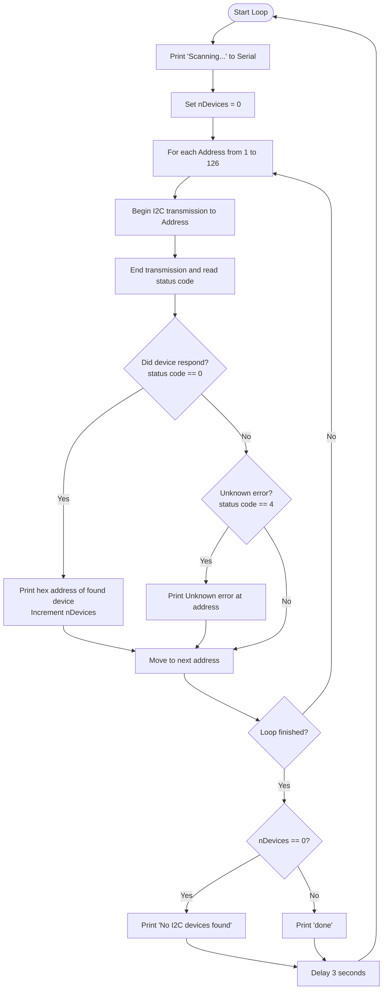

# I2C Scanner Diagnostic Tool (`I2C_Scanner`)

This diagnostic program scans the standard Inter-Integrated Circuit (I2C) serial bus for connected devices and reports their 7-bit hardware addresses to the Serial Monitor.

It is highly useful for checking if your AlphaBot2 chassis modules (like the PCF8574 expansion chip or the SSD1306 OLED display) are electrically connected and active.

---

## 🔌 Hardware Connections

I2C uses a shared bus containing two signals:
*   **SDA** (Serial Data): Labeled on the AlphaBot2 header. Connects internally to Arduino Uno pin **A4**.
*   **SCL** (Serial Clock): Labeled on the AlphaBot2 header. Connects internally to Arduino Uno pin **A5**.

---

## 📊 Flowchart



---

## 🔍 Code Walkthrough

1.  **I2C Initialisation**:
    ```cpp
    #include <Wire.h>
    Wire.begin();
    ```
    Loads the standard Arduino `Wire` library, which configures the hardware I2C peripherals inside the ATmega328P microcontroller at standard 100kHz speed.
2.  **Addressing Sweep**:
    ```cpp
    for (address = 1; address < 127; address++) {
      Wire.beginTransmission(address);
      error = Wire.endTransmission();
    ```
    The program opens a connection to the specific address, transmits the address byte, and ends transmission. If a device has its hardware lines connected and is programmed with that address, it pulls SCL/SDA to verify acknowledgment, returning `0` to the Arduino.
3.  **Address Output**:
    If a device is found, it formats the hex address representation and outputs it to the serial link at `115200` baud rate.

---

## 📋 Expected Serial Monitor Output

When running on a fully assembled AlphaBot2, you should expect to see:

```text
I2C Scanner
Scanning...
I2C device found at address 0x20  !
I2C device found at address 0x3C  !
done
```

### Addressing Key:
*   **`0x20`**: The **PCF8574 expansion chip** (used for buzzer, IR enabled/status read, joystick keys).
*   **`0x3C`**: The **SSD1306 OLED screen** (if plugged into the I2C socket).
