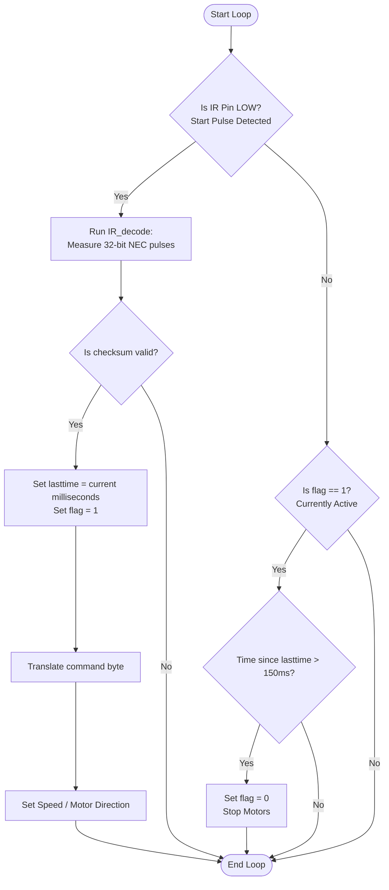

# Infrared Remote Control Car (`IR`)

This sketch allows you to control the AlphaBot2's movement and speed using an **Infrared (IR) Remote Control**.

---

## 🎮 Remote Control Mappings

| Remote Key | Code (HEX) | Function | Description |
| :--- | :--- | :--- | :--- |
| **`2`** | `0x18` | **Forward** | Drive forward at current speed |
| **`8`** | `0x52` | **Backward** | Drive backward at current speed |
| **`4`** | `0x08` | **Turn Left** | Pivot left in place (speed 50) |
| **`6`** | `0x5A` | **Turn Right** | Pivot right in place (speed 50) |
| **`5`** | `0x1C` | **Stop** | Stop both motors immediately |
| **`VOL-`** | `0x07` | **Speed Down** | Decrease speed by 10 (min 0) |
| **`VOL+`** | `0x15` | **Speed Up** | Increase speed by 10 (max 250) |
| **`EQ`** | `0x09` | **Reset Speed** | Reset speed to default `150` |

---

## ⚙️ Key Technical Features

### 1. Custom NEC Protocol Decoder (`IR_decode`)
Instead of importing a large library, this code decodes the **NEC Infrared protocol** directly by reading pulses on Pin 4 (`IR`).
- It detects a 9ms start pulse, followed by a 4.5ms space.
- It reads 32 data bits (address, inverse address, command, inverse command) by measuring the duration of logic `HIGH` pulses (0.56ms for binary `0`, 1.69ms for binary `1`).
- It performs a checksum check (`data[0]+data[1] == 0xFF`) to avoid errors.

### 2. "Dead-Man's Switch" Safety Timeout (Line 59)
When you press a key on your remote, the car will move. When you release the key, the remote stops transmitting.
- The loop monitors time since the last valid IR packet (`millis() - lasttime`).
- If no packet is received for **150ms**, the script automatically triggers `stop()`.
- This prevents the car from running off or crashing if the connection is lost.

---

## 📊 Flowchart

