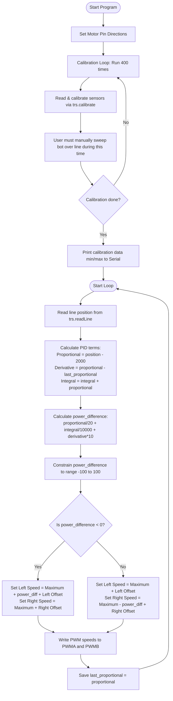

# Infrared Line Tracking Example (`Infrared-Line-Tracking`)

This program controls the AlphaBot2 to follow a black track line on a white background using the 5-channel bottom-facing infrared reflectance sensor array. It utilizes a **PID (Proportional, Integral, Derivative) feedback loop** to adjust motor speeds dynamically based on the line position.

---

## 🔌 Hardware Connections & Pins

The 5 reflectance sensors are connected to a **TLC1543 10-bit ADC chip** on the chassis, which communicates with the Arduino Uno over a custom SPI interface:

| Component Pin | Arduino Uno Pin | Function |
| :--- | :--- | :--- |
| **`CS`** | **`10`** | Chip Select for TLC1543 ADC |
| **`DataOut`** | **`11`** | SPI Data Out (MISO) |
| **`Address`** | **`12`** | SPI Address input |
| **`Clock`** | **`13`** | SPI Serial Clock |
| **`PWMA`** | **`6`** | Left Motor Speed (ENA) |
| **`AIN2`** | **`A0`** | Left Motor Direction (IN2) |
| **`AIN1`** | **`A1`** | Left Motor Direction (IN1) |
| **`PWMB`** | **`5`** | Right Motor Speed (ENB) |
| **`BIN1`** | **`A2`** | Right Motor Direction (IN3) |
| **`BIN2`** | **`A3`** | Right Motor Direction (IN4) |

---

## ⚙️ Calibration Procedure (CRITICAL)

When you turn on the AlphaBot2 running this sketch, the **first 10 seconds** of program execution are dedicated to sensor calibration. The motors will remain stationary at `0` speed.

> [!IMPORTANT]
> **⚠️ Required Manual Action during Calibration**:
> During this 10-second calibration window, you **must physically sweep the robot left and right** across the black track line and the white background multiple times.
>
> This manual sweep ensures that every one of the 5 sensors reads both the darkest value (black line) and lightest value (white surface), calibrating the high/low reflectance thresholds. If you do not move the robot, it will not track correctly!

---

## 📊 Flowchart

---

## 🔍 How the PID Algorithm Works

The line position returned by `trs.readLine(sensorValues)` is a value from `0` to `4000`:
*   `0` indicates the line is under Sensor 0 (far left).
*   `2000` indicates the line is centered directly under Sensor 2.
*   `4000` indicates the line is under Sensor 4 (far right).

The loop uses three correction components:
1.  **Proportional (P)**: Measures how far off-center the robot is (`position - 2000`). If the line is centered, `P = 0`.
2.  **Integral (I)**: Sums up all past errors to counteract cumulative drift.
3.  **Derivative (D)**: Measures the rate of change of error, dampening sudden swings and preventing the robot from oscillating wildly.

The motor speed difference is calculated as:
$$\text{power\_difference} = \frac{\text{Proportional}}{20} + \frac{\text{Integral}}{10000} + \text{Derivative} \times 10$$

*   If the robot drifts to the **right** (`power_difference > 0`), it slows down the right wheel to steer back right.
*   If the robot drifts to the **left** (`power_difference < 0`), it slows down the left wheel to steer back left.

---

## 🛠️ Modificiations & Calibrations Applied

The following changes were applied to the original code:
1.  **Motor Configuration Fix**: Replaced duplicate `AIN1/AIN2` pin declarations with `BIN1/BIN2` so the right motor direction pins are correctly outputting signals.
2.  **Wheel Calibration Offsets**: Added `LEFT_SPEED_OFFSET` (`0`) and `RIGHT_SPEED_OFFSET` (`-3`) to the PID motor speed outputs to compensate for physical motor imbalance.
