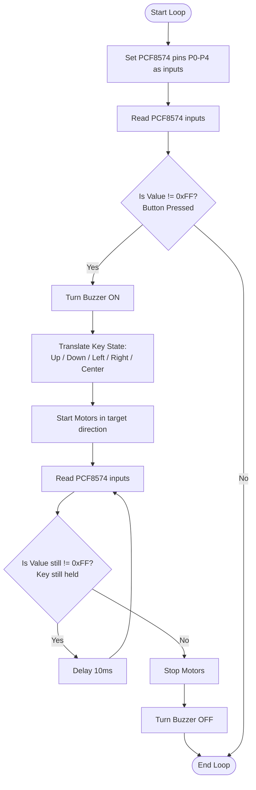

# Five-direction Remote Sensing (`Joystick`)

This program allows you to control the AlphaBot2's movement using the **5-direction joystick** on the top adapter board.

---

## 🕹️ Joystick Controls & Codes

The joystick buttons are read using the **PCF8574 I/O Expander** over I2C (Address `0x20`).

| Joystick Direction | PCF8574 Read Value | Motor Movement | Buzzer State | Serial Output |
| :--- | :--- | :--- | :--- | :--- |
| **Up** | `0xFE` | **Forward** (Speed 150) | **ON** | `"up"` |
| **Right** | `0xFD` | **Right Turn** (Speed 50) | **ON** | `"right"` |
| **Left** | `0xFB` | **Left Turn** (Speed 50) | **ON** | `"left"` |
| **Down** | `0xF7` | **Backward** (Speed 150) | **ON** | `"down"` |
| **Center (Press)** | `0xEF` | **Forward** (Speed 150) | **ON** | `"center"` |
| **No Press** | `0xFF` | **Stopped** | **OFF** | *None* |

---

## ⚙️ How it Works

1. **I2C Initialization**: Starts the standard `Wire` library inside `setup()`.
2. **Reading Inputs**: In `loop()`, it writes `0x1F` to the PCF8574 pins P0-P4 to set them as pull-up inputs. It then reads back their state. If a pin is grounded (value is not `0xFF`), it registers a button press.
3. **Sounding the Buzzer**: When any button is pressed, the buzzer sounds continuously via the `beep_on` macro.
4. **Active Hold State**: The code enters a `while(value != 0xFF)` loop. As long as you keep holding the joystick, the robot keeps moving and the buzzer keeps sounding.
5. **Release Safety**: As soon as you release the joystick, the read value becomes `0xFF`, it exits the loop, shuts off the buzzer (`beep_off`), and stops both motors.

---

## 📊 Flowchart

