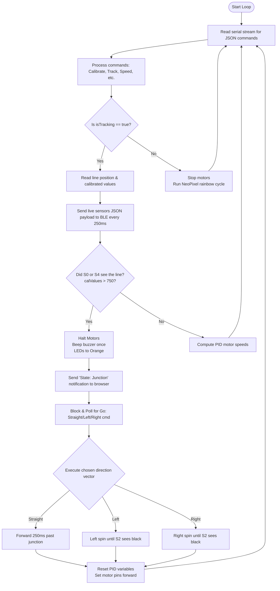

# Interactive BLE Junction Line-Tracking (`Line-Tracking-BLE-Junctions`)

This project implements a line-following system for the AlphaBot2 that autonomously tracks lines, halts at road junctions (nodes), notifies a connected web browser over Bluetooth Low Energy (BLE), and waits for the user to steer it by clicking buttons on their screen.

---

## 🔌 Hardware Connections & Pins

The system controls the motors, RGB LEDs, and utilizes the I2C bus:

| Component | Arduino Pin | Function / Description |
| :--- | :--- | :--- |
| **`PWMA`** | **`6`** | Left Motor Speed (ENA) |
| **`AIN2`** | **`A0`** | Left Motor Direction (IN2) |
| **`AIN1`** | **`A1`** | Left Motor Direction (IN1) |
| **`PWMB`** | **`5`** | Right Motor Speed (ENB) |
| **`BIN1`** | **`A2`** | Right Motor Direction (IN3) |
| **`BIN2`** | **`A3`** | Right Motor Direction (IN4) |
| **`SDA / SCL`** | **`A4 / A5`** | Hardware I2C Bus |
| **`OLED_RESET`** | **`9`** | SSD1306 Display Reset |
| **`OLED_SA0`** | **`8`** | Display Address Select pin (pulled `LOW` for `0x3C`) |
| **`RGB_PIN`** | **`7`** | WS2812B NeoPixel Signal Line |

---

## 📡 BLE JSON Communication Protocol

Communication is bi-directional over BLE serial at `9600` baud. The messages are structured as JSON strings delimited by newlines (`\n`).

### 1. Browser-to-Robot Commands (`TX`)

* **Calibrate Sensors**:
  ```json
  {"Calibrate":"Start"}
  ```
* **Toggle Line Tracking**:
  ```json
  {"LineTracking":"Start"}
  {"LineTracking":"Stop"}
  ```
* **Junction Steering Selection**:
  ```json
  {"Go":"Straight"}
  {"Go":"Left"}
  {"Go":"Right"}
  ```
* **Manual D-Pad Override** (Active in Stopped/Idle state):
  ```json
  {"Forward":"Down"} or {"Forward":"Up"}
  {"Backward":"Down"} or {"Backward":"Up"}
  {"Left":"Down"} or {"Left":"Up"}
  {"Right":"Down"} or {"Right":"Up"}
  {"Stop":"Down"}
  ```
* **Buzzer/Horn Control**:
  ```json
  {"BZ":"on"} or {"BZ":"off"}
  ```

### 2. Robot-to-Browser Telemetry (`RX`)

* **Status Updates**:
  ```json
  {"State":"Calibrating"}
  {"State":"Calibrated"}
  {"State":"Tracking"}
  {"State":"Junction"}
  {"State":"Stopped"}
  ```
* **Real-time Sensors Output** (sent every 250ms when tracking):
  ```json
  {"Sensors":[val0,val1,val2,val3,val4],"Pos":position,"State":"Tracking"}
  ```
  * `Sensors`: Array of 5 calibrated reflectance channel readings (0 = White, 1000 = Solid Black).
  * `Pos`: Estimated position relative to the line (0 to 4000, where 2000 is perfectly centered).

---

## ⚙️ Operating Instructions

### Step 1: Open the Dashboard
1. Open the [bluetooth_junction_controller.html](file:///f:/AlphaBot2/bluetooth_junction_controller.html) dashboard in Chrome, Edge, or Opera.
2. Click **Connect Bot** and choose your robot's BLE module (e.g., HM-10).

### Step 2: Calibrate
1. Place the robot over the line.
2. Click **Calibrate Sensors** on the dashboard. The robot will rotate left/right to register track contrast.
3. Once completed, the dashboard will display a live reflectance levels graph for each sensor, and a pointer cursor representing the line's position under the bot.

### Step 3: Run Tracking
1. Click **Start Line Tracking**.
2. The robot will begin tracking autonomously. You can monitor its alignment live via the browser's slider.

### Step 4: Navigate Junctions
1. When the robot reaches an intersection where either the far-left sensor `S0` or far-right sensor `S4` hits the line (`value > 750`):
   * The robot stops immediately and beeps.
   * Its headlights turn **Orange**.
   * The browser pops up a modal window saying: **Junction Detected!**
2. Click **Turn Left**, **Go Straight**, or **Turn Right** on your browser (or press the Arrow keys / `W`, `A`, `D` on your keyboard).
3. The robot turns, locks onto the line, and continues tracking autonomously.

---

## 📊 Flowchart


