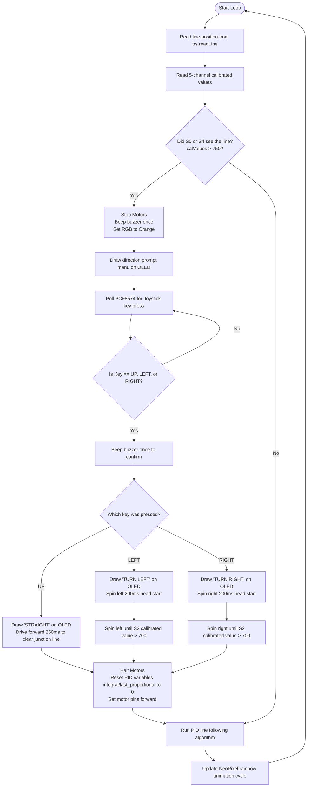

# Interactive Junction Line Tracking (`Line-Tracking-Junctions`)

This program allows the AlphaBot2 to autonomously follow a line, stop when it reaches a road junction (node), and wait for the user to steer it at the intersection using the onboard **Joystick key**.

Once a direction is selected, the robot executes the turn, locks back onto the line, and resumes autonomous PID line following.

---

## 🔌 Hardware Connections & Pins

The sketch controls both the motors, the RGB NeoPixel LEDs, and reads from the shared I2C bus:

| Component | Arduino Pin | Function / Description |
| :--- | :--- | :--- |
| **`PWMA`** | **`6`** | Left Motor Speed (ENA) |
| **`AIN2`** | **`A0`** | Left Motor Direction (IN2) |
| **`AIN1`** | **`A1`** | Left Motor Direction (IN1) |
| **`PWMB`** | **`5`** | Right Motor Speed (ENB) |
| **`BIN1`** | **`A2`** | Right Motor Direction (IN3) |
| **`BIN2`** | **`A3`** | Right Motor Direction (IN4) |
| **`SDA / SCL`** | **`A4 / A5`** | Hardware I2C Bus |
| **`OLED_RESET`** | **`9`** | SSD1306 Display Reset pin |
| **`OLED_SA0`** | **`8`** | Display Address Select pin (pulled LOW to lock `0x3C`) |
| **`RGB_PIN`** | **`7`** | WS2812B NeoPixel Signal Line |

### Shared I2C Slave Addresses:
*   **`0x20`**: **PCF8574 expander chip** (polled to detect joystick presses).
*   **`0x3C`**: **SSD1306 OLED screen** (displays UI messages and direction prompt menu).

---

## ⚙️ Interactive Operational Instructions

### Step 1: Calibration
When powered on, follow the standard calibration prompts:
1. Press the **center Joystick key** to start.
2. The robot automatically rotates left/right to calibrate the bottom sensors.
3. Once finished, slide the robot to check the visual pointer (`**`) on the OLED display.
4. Press the **center Joystick key** again to start driving.

### Step 2: Junction Halt & Menu
When the robot encounters a road junction (any left or right turn branch where sensor `S0` or `S4` detects the line):
1. The robot automatically **stops** and the buzzer beeps once.
2. The bottom NeoPixels turn solid **Orange**.
3. The OLED screen displays the prompt menu:
   ```text
   JUNCTION DETECTED
   -----------------
   Choose Direction:
    [W/UP]   -> Straight
    [A/LEFT] -> Turn Left
    [D/RGHT] -> Turn Right
   ```

### Step 3: Steering Decision
Press one of the following Joystick directions to make the robot navigate:
*   **Flick Joystick UP** ➡️ Drives straight across the intersection.
*   **Flick Joystick LEFT** ➡️ Spins left on the spot until the center sensor locks onto the new line.
*   **Flick Joystick RIGHT** ➡️ Spins right on the spot until the center sensor locks onto the new line.

Once the choice is executed, the robot automatically resets its PID logic and resumes following the line until the next junction!

---

## 📊 Flowchart



---

## 🔍 How the Code Works

1.  **Node/Junction Detection**:
    ```cpp
    if (calValues[0] > 750 || calValues[4] > 750) { ... }
    ```
    The far-left sensor (`S0`) and far-right sensor (`S4`) sit outside the standard line-following envelope. If either of these registers a calibrated value greater than `750`, it indicates that the robot has arrived at a branch or intersection.
2.  **Interactive Blocking Input Loop**:
    When a junction is triggered, the program stops the motors and enters a `while(true)` loop to poll the PCF8574 expander chip over I2C, checking if joystick up, left, or right keys are activated.
3.  **Autonomous Turn Lock-on**:
    For turns (left or right), the robot starts spinning on the spot. To prevent it from stopping immediately on the *current* track line, it turns blindly for a short `200ms` head start. Then, it enters a fast monitoring loop checking `calValues[2] > 700` (meaning the center sensor `S2` has locked onto the new black line). Once detected, the robot stops spinning, aligning itself perfectly onto the new branch line.
