# Advanced OLED Line Tracking Example (`Line-Tracking`)

This program controls the AlphaBot2 to follow a black track line using the bottom 5-channel TRSensors array. Unlike the basic line tracking sketch, this version features **automatic motor-driven calibration**, displays calibration readings and a visual line position bar on the **onboard OLED screen**, and coordinates setup via the **joystick button**.

---

## 🔌 Hardware Connections & Pins

The sketch controls both the motors, the RGB NeoPixel LEDs, and reads from the shared I2C bus:

| Component | Arduino Pin | Function / Description |
| :--- | :--- | :--- |
| **`PWMA`** | **`6`** | Left Motor Speed (ENA) |
| **`AIN2`** | **`A0`** | Left Motor Direction (IN2) |
| **`AIN1`** | **`A1`** | Left Motor Direction (IN1) |
| **`PWMB`** | **`5`** | Right Motor Speed (ENB) |
| **`BIN1`** | **`A2`** | Right Motor Direction (IN3) |
| **`BIN2`** | **`A3`** | Right Motor Direction (IN4) |
| **`SDA / SCL`** | **`A4 / A5`** | Hardware I2C Bus |
| **`OLED_RESET`** | **`9`** | SSD1306 Display Reset pin |
| **`OLED_SA0`** | **`8`** | Display Address Select pin (pulled LOW to lock `0x3C`) |
| **`RGB_PIN`** | **`7`** | WS2812B NeoPixel Signal Line |

### Shared I2C Slave Addresses:
*   **`0x20`**: **PCF8574 expander chip** (polled to detect joystick presses).
*   **`0x3C`**: **SSD1306 OLED screen** (displays UI messages and the sensor pointer).

---

## ⚙️ Interactive Operational Instructions

### Step 1: Trigger Calibration
When powered on, the OLED screen will display **`WaveShare AlphaBot2`** and prompt **`Press to calibrate`**. The RGB lights will glow solid green.
*   **Action**: Press the center **Joystick key** down once.

### Step 2: Automatic Calibration (No Manual Sweep Needed!)
*   Once you press the button, the robot **automatically spins the wheels** to rotate left and right.
*   This sweeps the bottom sensor array back and forth over the line automatically. 
*   **Note**: Ensure the robot is placed directly over the black tape track before pressing the button!

### Step 3: Diagnostic Visual Monitor
When the automatic rotation finishes, the wheels stop, the RGB lights turn blue, and the OLED displays **`Calibration Done !!!`** alongside a live graphic tracking bar:
```text
_____________________
          **
```
*   **Action**: Slide the robot slightly side-to-side. You will see the `**` pointer slide dynamically along the line to show where the line is located under the bot.
*   **Launch driving**: Press the center **Joystick key** a second time.

### Step 4: Line Tracking
The OLED prints **`AlphaBot2 Go!`**, the RGB LEDs start an animated rainbow cycle, and the robot drives forward at high speed (`255` maximum) following the track line. If it runs off the track completely, it halts automatically.

---

## 📊 Flowchart

```mermaid
graph TD
    Start([Start Program]) --> PinConfig[Set Motor Pin Directions]
    PinConfig --> OLEDInit[Initialize OLED Screen at 0x3C]
    OLEDInit --> PrintPrompt[OLED: Display 'Press to calibrate']
    
    PrintPrompt --> WaitBtn1{Joystick Button Pressed?}
    WaitBtn1 -- No --> PrintPrompt
    WaitBtn1 -- Yes --> StartRotation[Start Auto-Rotation & Calibration]
    
    StartRotation --> SpinLoop[Spin bot left/right while calling trs.calibrate]
    SpinLoop --> CheckSpinDone{Spin calibration finished?}
    
    CheckSpinDone -- No --> SpinLoop
    CheckSpinDone -- Yes --> StopRotation[Stop Motors<br>OLED: Display 'Calibration Done !!!' & live sensor bar]
    
    StopRotation --> WaitBtn2{Joystick Button Pressed?}
    WaitBtn2 -- No --> UpdateSensorBar[Draw live line position bar on OLED]
    UpdateSensorBar --> WaitBtn2
    
    WaitBtn2 -- Yes --> StartDriving[OLED: Display 'Go!'<br>Enable RGB LED rainbow anim]
    
    StartDriving --> LoopStart([Start Loop])
    LoopStart --> ReadPos[Read line position from trs.readLine]
    
    ReadPos --> CheckNoLine{No line detected? <br> S1, S2, S3 values > 900}
    CheckNoLine -- Yes --> StopBot[Stop Motors]
    CheckNoLine -- No --> CalcPID[Calculate PID terms:<br>Proportional = position - 2000<br>Derivative = proportional - last_proportional<br>Integral = integral + proportional]
    
    StopBot --> DrawRGB[Update RGB colors]
    
    CalcPID --> CalcDiff[Calculate power_difference:<br>proportional/20 + integral/10000 + derivative*10]
    CalcDiff --> ConstrainDiff[Constrain power_difference to range -255 to 255]
    
    ConstrainDiff --> CheckDirection{Is power_difference < 0?}
    CheckDirection -- Yes --> LeftCorr[Left Speed = Maximum + power_diff + Offset<br>Right Speed = Maximum + Offset]
    CheckDirection -- No --> RightCorr[Left Speed = Maximum + Offset<br>Right Speed = Maximum - power_diff + Offset]
    
    LeftCorr --> ApplyPWM[Write PWM speeds to PWMA and PWMB]
    RightCorr --> ApplyPWM
    
    ApplyPWM --> SaveState[Save last_proportional = proportional]
    SaveState --> DrawRGB
    
    DrawRGB --> LoopStart
```



---

## 🛠️ Modifications Applied

1.  **OLED Driver Update**:
    *   **Problem**: The original Adafruit SSD1306 constructor parameter layout corrupted display buffer allocations in modern library versions.
    *   **Fix**: Modified the constructor call to `display(128, 64, &Wire, OLED_RESET)` and pulled pin `8 (OLED_SA0)` **LOW** in `setup()` to secure standard I2C communications at address `0x3C`.
2.  **Motor Driver Setup Bug**:
    *   **Problem**: Duplicate outputs were written to left direction pins while right direction pins `BIN1` and `BIN2` were left unconfigured.
    *   **Fix**: Repaired pin configurations to properly set outputs for `BIN1` and `BIN2`.
3.  **Wheel Calibration Offsets**:
    *   Set `LEFT_SPEED_OFFSET` and `RIGHT_SPEED_OFFSET` to `0` in code declarations, and applied them to motor speed writes.
