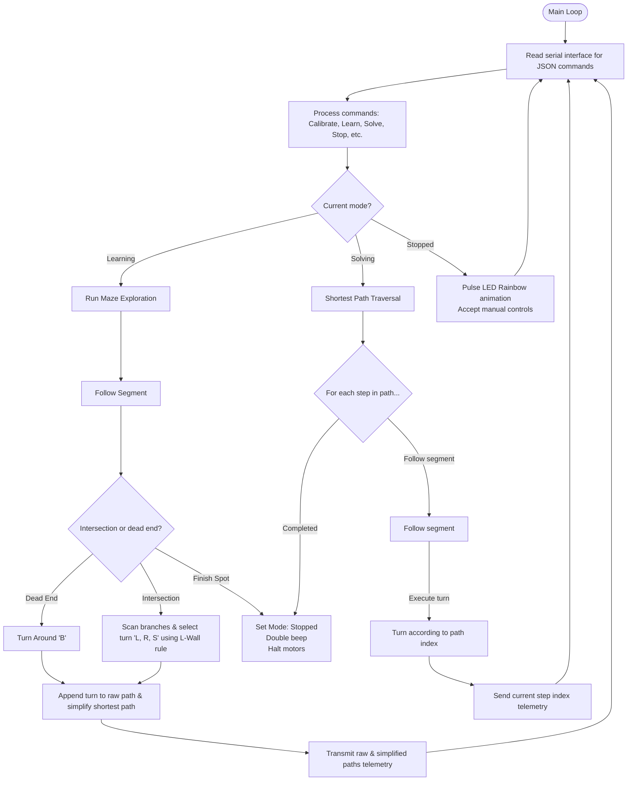

# Interactive BLE Maze Solver (`Maze-Solver-BLE`)

This project implements a Bluetooth Low Energy (BLE) controlled Maze Solver for the Waveshare AlphaBot2. It autonomously explores a grid-based line maze, applies the **Left-Hand-on-the-Wall** algorithm, simplifies dead ends (U-turns) in real-time, sends telemetry to a web browser interface, and traverses the optimized shortest path.

---

## 🔌 Hardware Connections & Pins

The system controls the motors, RGB NeoPixels, and communicates via I2C:

| Component | Arduino Pin | Function / Description |
| :--- | :--- | :--- |
| **`PWMA`** | **`6`** | Left Motor Speed (ENA) |
| **`AIN2`** | **`A0`** | Left Motor Direction (IN2) |
| **`AIN1`** | **`A1`** | Left Motor Direction (IN1) |
| **`PWMB`** | **`5`** | Right Motor Speed (ENB) |
| **`BIN1`** | **`A2`** | Right Motor Direction (IN3) |
| **`BIN2`** | **`A3`** | Right Motor Direction (IN4) |
| **`SDA / SCL`** | **`A4 / A5`** | Hardware I2C Bus |
| **`RGB_PIN`** | **`7`** | WS2812B NeoPixel Signal Line (x4) |

---

## 📡 BLE JSON Communication Protocol

Communication is bi-directional over BLE serial at `9600` baud. Telemetry packets are sent as JSON strings delimited by newlines (`\n`).

### 1. Browser-to-Robot Commands (`TX`)

* **Calibrate Sensors**:
  ```json
  {"Calibrate":"Start"}
  ```
* **Maze Control Triggers**:
  ```json
  {"Maze":"Learn"}
  {"Maze":"Solve"}
  {"Maze":"Stop"}
  {"Maze":"Clear"}
  ```
* **Manual Overrides** (Active in Stopped/Idle states):
  ```json
  {"Forward":"Down"} or {"Forward":"Up"}
  {"Backward":"Down"} or {"Backward":"Up"}
  {"Left":"Down"} or {"Left":"Up"}
  {"Right":"Down"} or {"Right":"Up"}
  {"Stop":"Down"}
  ```
* **Horn & Headlights**:
  ```json
  {"BZ":"on"} or {"BZ":"off"}
  {"RGB":"R,G,B"}
  ```

### 2. Robot-to-Browser Telemetry (`RX`)

* **Status Packets**:
  ```json
  {"State":"Stopped","Path":"...","SimPath":"..."}
  {"State":"Calibrating"}
  {"State":"Calibrated"}
  {"State":"Learning","Path":"LBL","SimPath":"S"}
  {"State":"Solving","Step":2,"Path":"LBL","SimPath":"S"}
  ```
* **Real-time Reflectance Sensor Array** (Sent every 250ms during active line tracking):
  ```json
  {"Sensors":[s0,s1,s2,s3,s4],"Pos":position,"State":"Learning","Path":"LBL","SimPath":"S"}
  ```
  * `Sensors`: Array of 5 calibrated reflectance readings (0 = White background, 1000 = Solid Black line).
  * `Pos`: Estimated line center alignment position (0 to 4000, where 2000 is centered).

---

## ⚙️ Operating Instructions

### Step 1: Upload the Sketch
1. **⚠️ CRITICAL**: Unplug the BLE serial module from the AlphaBot2 during flashing to prevent port conflicts on serial pins `D0`/`D1`.
2. Connect the board via USB, select compilation task `Ctrl + Shift + B`, and upload. Reinsert the BLE module afterwards.

### Step 2: Open the Dashboard
1. Open the [bluetooth_maze_controller.html](file:///f:/AlphaBot2/bluetooth_maze_controller.html) dashboard in Chrome or Edge.
2. Click **Connect Bot** and pair with the AlphaBot2 BLE module.

### Step 3: Calibration
1. Place the robot over the line.
2. Click **Calibrate Sensors** on the dashboard. The robot will rotate to scan the floor contract. Live sensor bars and line alignment cursor will activate.

### Step 4: Explore and Map (Learning Phase)
1. Place the robot at the start of your line maze.
2. Click **Learn Maze Path**.
3. The robot will follow segments, detect intersections, and execute decisions.
4. When a dead end is hit, it turns around (`B`). The dashboard path tracker will show the raw exploration path alongside the optimized shortest path simplified in real-time.
5. Once all middle sensors hit solid black at the goal, the robot beeps twice and halts.

### Step 5: Traversal (Solving Phase)
1. Place the robot back at the starting line.
2. Click **Run Shortest Path**.
3. The robot will follow the path directly to the goal, ignoring dead ends. The active capsule badge on the dashboard updates to indicate the turn being executed.

---

## 📊 Control Flowchart


