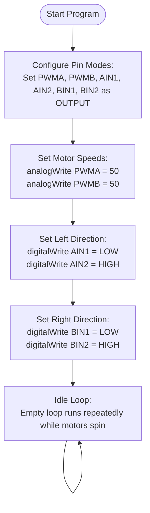

# Motor Test (`Run_Test`)

This program verifies that the AlphaBot2's **TB6612FNG** dual motor driver is wired correctly and functions properly. It runs the left and right motors forward at a low, constant speed.

---

## 🔌 Pin Mapping

| Control Line | Arduino Pin | Function |
| :--- | :--- | :--- |
| `PWMA` | **D6** | Left Motor Speed Control (PWM) |
| `AIN2` | **A0** | Left Motor Direction Line 2 |
| `AIN1` | **A1** | Left Motor Direction Line 1 |
| `PWMB` | **D5** | Right Motor Speed Control (PWM) |
| `BIN1` | **A2** | Right Motor Direction Line 1 |
| `BIN2` | **A3** | Right Motor Direction Line 2 |

---

## ⚙️ How it Works

1. **Configuration**: Sets the speed controller pins (`PWMA`, `PWMB`) and all direction lines (`AIN1`, `AIN2`, `BIN1`, `BIN2`) as `OUTPUT` pins.
2. **Speed Setup**: Writes a PWM duty cycle of `50` (about 20% of maximum speed `255`) to both `PWMA` and `PWMB`.
3. **Direction Setup**:
   - Moves the Left Motor forward by setting `AIN1 = LOW` and `AIN2 = HIGH`.
   - Moves the Right Motor forward by setting `BIN1 = LOW` and `BIN2 = HIGH`.
4. **Main Loop**: The main loop remains empty. The motors will continue spinning at speed 50 indefinitely until the controller is powered off or flashed with a different program.

---

## 🔄 Reversing Motor Directions

If your robot moves backwards or spins in a circle, the wiring directions are inverted relative to the program. To fix this in software:
- **Left wheel rotating backwards**: Swap the values of `AIN1` and `AIN2` in the pin definitions.
- **Right wheel rotating backwards**: Swap the values of `BIN1` and `BIN2` in the pin definitions.

---

## 📊 Flowchart

