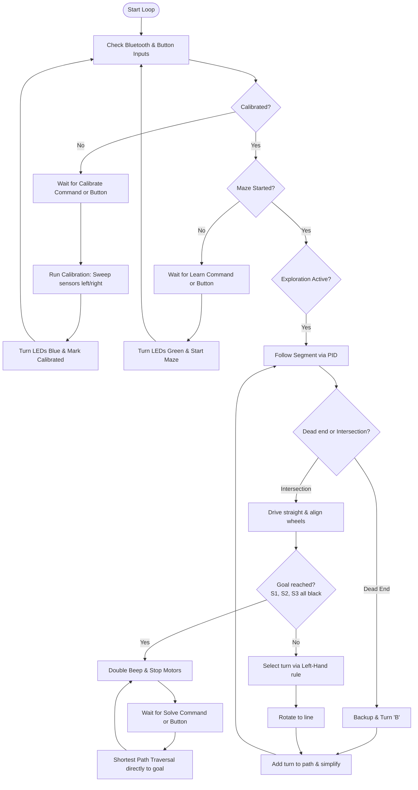

# Simplified BLE Maze Solver (`Simple-Maze-Solver-BLE`)

This project implements a memory-optimized, lag-free Bluetooth Low Energy (BLE) extension of the standard maze solver (`MazeSolver.ino`) for the Waveshare AlphaBot2. It retains the exact physics, line-following PID logic, and turn delays of the original standalone maze solver, but allows control over BLE Serial (9600 baud) through a simplified glassmorphic web dashboard.

---

## 🚀 Key Optimizations

1. **OLED Screen Removal (RAM Stabilization)**:
   * **Problem**: The dynamic buffer allocation of the `Adafruit_SSD1306` library consumes over 1KB of RAM, pushing total SRAM utilization to **91%**, which causes heap corruption and tracking lag.
   * **Fix**: Removed the OLED code and library inclusions entirely. Global RAM usage drops to just **33%** (683 bytes used), ensuring perfect execution stability. Status information is displayed via the on-board NeoPixel LEDs.
2. **Zero-Lag Navigation**:
   * **Problem**: Emitting sensor telemetry constantly over a 9600-baud BLE serial connection blocks the microcontroller's CPU execution for 40-50ms every loop iteration, causing the robot to twitch and lose tracking.
   * **Fix**: Disabled live telemetry output during active navigation. Serial transmissions are silent during line-following, guaranteeing identical PID smoothness to the standalone version.

---

## 🔌 Hardware Connections & Pins

| Component Pin | Arduino Uno Pin | Function / Description |
| :--- | :--- | :--- |
| **`PWMA`** | **`6`** | Left Motor Speed (ENA) |
| **`AIN2`** | **`A0`** | Left Motor Direction (IN2) |
| **`AIN1`** | **`A1`** | Left Motor Direction (IN1) |
| **`PWMB`** | **`5`** | Right Motor Speed (ENB) |
| **`BIN1`** | **`A2`** | Right Motor Direction (IN3) |
| **`BIN2`** | **`A3`** | Right Motor Direction (IN4) |
| **`RGB_PIN`** | **`7`** | WS2812B NeoPixel Signal Line (x4) |

---

## 📡 BLE JSON Communication Protocol

All commands are sent as JSON strings terminated with a newline (`\n`) over the BLE serial module at `9600` baud:

* **Calibrate Sensors**:
  ```json
  {"Calibrate":"Start"}
  ```
* **Start Maze Exploration (Learning Phase)**:
  ```json
  {"Maze":"Learn"}
  ```
* **Run Shortest Path (Solving Phase)**:
  ```json
  {"Maze":"Solve"}
  ```
* **Horn Buzzer Control**:
  ```json
  {"BZ":"on"} or {"BZ":"off"}
  ```

---

## ⚙️ Operating Instructions

### Step 1: Flash the Code
1. **⚠️ CRITICAL**: Always **unplug the HM-10 BLE module** from the AlphaBot2 board before uploading the sketch to prevent serial port conflicts on pins `D0`/`D1`.
2. Connect the robot to your PC via USB and upload the sketch.
3. Once flashing completes, disconnect the USB cable and plug the BLE module back in.

### Step 2: Connect via the Web Dashboard
1. Open [simple_ble_controller.html](file:///f:/AlphaBot2/simple_ble_controller.html) in a Web Bluetooth-supported browser (Chrome or Edge).
2. Click **Connect Bot** and pair with the AlphaBot2's BLE module.
3. Once connected, the dashboard buttons will unlock.

### Step 3: Calibrate and Run
1. Place the robot on the black line track.
2. Click **Calibrate Sensors** on the dashboard. The robot will rotate left and right over the line to calibrate.
3. Place the robot at the start of your maze, and click **Start Maze Solver**. The robot will explore the maze using the Left-Hand-on-the-Wall strategy.
4. Once the goal is reached, the robot stops. Place it back at the start, and click **Run Shortest Path** to watch it traverse the optimized route directly to the finish.

---

## 📊 Control Flowchart


