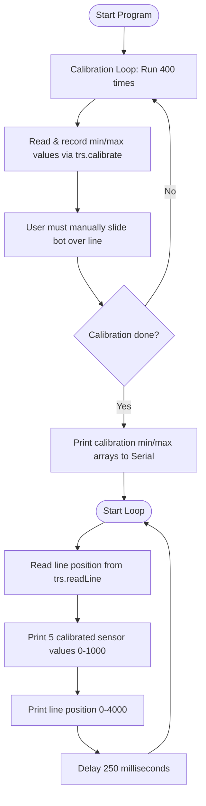

# Reflectance Sensor Diagnostic Example (`TRSensorExample`)

This diagnostic program reads and calibrates the 5 bottom-facing infrared reflectance sensors on the AlphaBot2. It prints the calibrated reflectance values (from `0` to `1000`) for all 5 sensors along with the calculated line position (from `0` to `4000`) to the Serial Monitor.

It is the ideal tool to verify that your bottom tracking sensors are working and aligned before testing autonomous line tracking or maze solving.

---

## 🔌 Hardware Connections & Pins

The bottom sensors are multiplexed through a **TLC1543 10-bit analog-to-digital converter (ADC) chip** which communicates with the Arduino Uno over a custom SPI interface:

| Component Pin | Arduino Uno Pin | Function |
| :--- | :--- | :--- |
| **`CS`** | **`10`** | Chip Select for TLC1543 ADC |
| **`DataOut`** | **`11`** | SPI Data Out (MISO) |
| **`Address`** | **`12`** | SPI Address Input |
| **`Clock`** | **`13`** | SPI Serial Clock |

---

## ⚙️ Calibration Procedure

When you boot the Arduino, the first **10 seconds** of program execution are dedicated to calibrating the sensors.

> [!IMPORTANT]
> **⚠️ User Action Required during Calibration**:
> During this 10-second calibration window, you **must manually slide the robot back and forth** across the black track line and the white background surface. 
> This sweeps each of the 5 sensors across the black tape and white floor to map the absolute darkest (minimum reflection) and lightest (maximum reflection) bounds.

---

## 📊 Flowchart



---

## 📋 How to Interpret Serial Monitor Output

Open the Serial Monitor at **115200 baud** to read the logs:

### 1. Calibration Arrays (Printed once after 10 seconds):
```text
calibrate done
120 115 130 110 125    <-- Minimum bounds read (white floor)
850 820 890 810 830    <-- Maximum bounds read (black line)
```

### 2. Live Sensor Loop (Printed every 250ms):
```text
S0      S1      S2      S3      S4      Line Position
0       0       1000    0       0       2000
```

*   **Sensor Values (`0` to `1000`)**:
    *   **`0`**: Maximum light reflectance (indicates the sensor is directly over the **white surface**).
    *   **`1000`**: Minimum light reflectance (indicates the sensor is directly over the **black line** or in thin air).
*   **Line Position (`0` to `4000`)**:
    *   **`0`**: The black line is under Sensor 0 (far left).
    *   **`2000`**: The black line is centered under Sensor 2.
    *   **`4000`**: The black line is under Sensor 4 (far right).
