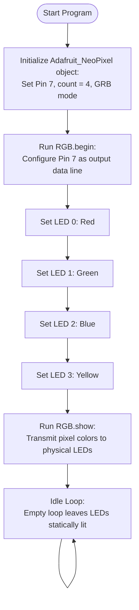

# RGB LED (`W2812`)

This program demonstrates how to control the 4 serial-controlled **WS2812B RGB LEDs** located at the bottom of the AlphaBot2 chassis.

---

## 🔌 Hardware Setup

*   **Quantity**: 4 Addressable RGB LEDs (Indexed `0` to `3`).
*   **Data Pin**: Connected to **Digital Pin 7** on the Arduino.
*   **Library**: Uses the `Adafruit_NeoPixel` library (included in `Arduino/libraries`).

---

## 🎨 Color Mapping (Default Program)

When the code runs, it sets a distinct color for each of the 4 LEDs:

| LED Index | Position on Chassis | Color | RGB Value |
| :--- | :--- | :--- | :--- |
| **`0`** | Bottom Left | **Red** | `(255, 0, 0)` |
| **`1`** | Bottom Center-Left | **Green** | `(0, 255, 0)` |
| **`2`** | Bottom Center-Right | **Blue** | `(0, 0, 255)` |
| **`3`** | Bottom Right | **Yellow** | `(255, 255, 0)` |

---

## 📊 Flowchart

