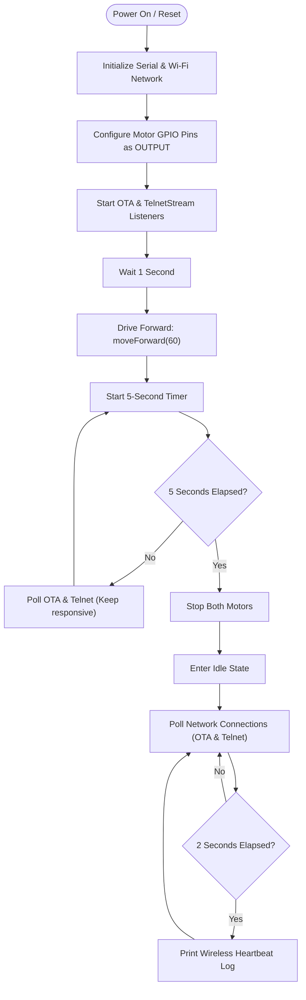

# 🧪 Experiment 01: Open-Loop Control & H-Bridge Motor Calibration (R4 WiFi Edition)

## 🎯 Objectives
1. Understand the operation of a dual H-Bridge motor driver on the AlphaBot2 chassis using an **Arduino UNO R4 WiFi**.
2. Observe open-loop speed drift caused by physical hardware variances in DC motors.
3. Configure speed calibration **offsets** in software to ensure the robot travels in a straight line.

---

## 🛠️ Theoretical Background

### 1. Motor Speed & H-Bridge Control
To move the AlphaBot2, the Arduino must communicate with the TB6612FNG H-bridge chip on the bottom chassis. For each motor:
* **2 Digital Pins** control direction (forward, backward, coast, or brake).
* **1 Analog (PWM) Pin** controls speed by switching the power rapidly on and off. The average voltage is determined by the **Duty Cycle** (a PWM value from 0 to 255).

The UNO R4 WiFi's Renesas RA4M1 microcontroller generates these PWM signals on pins D5 and D6.

### 2. Motor Variances & Calibration Offsets
Although both motors are identical models (N20 gear motors), physical differences in gear friction, coil resistance, and manufacturing tolerances cause them to spin at slightly different rates when given the same PWM power.

To make the robot drive in a perfectly straight line without active sensors, we apply a static offset in software:
* Applied Left Speed = Base Speed + LEFT_SPEED_OFFSET
* Applied Right Speed = Base Speed + RIGHT_SPEED_OFFSET

---

## 🔌 Hardware Connections & Microcontroller Pins

The H-bridge pins map to the Arduino UNO R4 WiFi pins identically to the R3:

| Motor | Control Line | Arduino Pin | Pin Function |
| :--- | :--- | :--- | :--- |
| **Left** | **`PWMA`** | **`D6`** | Speed Control (PWM) |
| **Left** | **`AIN1`** | **`A1`** | Direction Line 1 |
| **Left** | **`AIN2`** | **`A0`** | Direction Line 2 |
| **Right** | **`PWMB`** | **`D5`** | Speed Control (PWM) |
| **Right** | **`BIN1`** | **`A2`** | Direction Line 1 |
| **Right** | **`BIN2`** | **`A3`** | Direction Line 2 |

* **Direction Code (Forward)**:
  * Left Motor: `AIN1 = LOW`, `AIN2 = HIGH`
  * Right Motor: `BIN1 = LOW`, `BIN2 = HIGH`

---

## 🧠 Logical Flow & System Architecture

### 1. Hardware Control Path Diagram
The diagram below illustrates how commands flow from the Renesas RA4M1 microcontroller on the Arduino UNO R4 WiFi to the DC gear motors via the TB6612FNG H-bridge driver:

```mermaid
graph LR
    Arduino[Arduino UNO R4 WiFi] -- "PWM Speed (D6, D5)" --> ENA_ENB[TB6612FNG Speed Inputs (PWMA / PWMB)]
    Arduino -- "Direction Controls (A0-A3)" --> IN_Pins[TB6612FNG Control Inputs (AIN1/AIN2/BIN1/BIN2)]
    
    subgraph HBridge ["TB6612FNG Dual H-Bridge Driver"]
        direction TB
        ENA_ENB
        IN_Pins
    end
    
    HBridge -- "Motor Output A (Power & Polarity)" --> LeftMotor[Left N20 DC Motor]
    HBridge -- "Motor Output B (Power & Polarity)" --> RightMotor[Right N20 DC Motor]

    style Arduino fill:#00979C,stroke:#005C5E,stroke-width:2px,color:#fff
    style HBridge fill:#f9f9f9,stroke:#333,stroke-width:1px
    style LeftMotor fill:#ffde59,stroke:#e5c100,stroke-width:2px
    style RightMotor fill:#ffde59,stroke:#e5c100,stroke-width:2px
```

### 2. Software Logic flowchart
This flowchart shows the execution path of the code from startup, through the 5-second movement phase, and into the idle wireless monitoring loop:



### 3. Pseudocode
```text
Initialize digital output pins: PWMA, AIN1, AIN2, PWMB, BIN1, BIN2

Define LEFT_SPEED_OFFSET = 0
Define RIGHT_SPEED_OFFSET = 0

Function moveForward(baseSpeed):
    finalLeft = baseSpeed + LEFT_SPEED_OFFSET
    finalRight = baseSpeed + RIGHT_SPEED_OFFSET

    // Clamp speed limits to valid PWM range [0, 255]
    finalLeft = Constrain(finalLeft, 0, 255)
    finalRight = Constrain(finalRight, 0, 255)

    // Set Left Motor to Forward
    digitalWrite(AIN1, LOW)
    digitalWrite(AIN2, HIGH)
    
    // Set Right Motor to Forward
    digitalWrite(BIN1, LOW)
    digitalWrite(BIN2, HIGH)

    // Output analog PWM speed values
    analogWrite(PWMA, finalLeft)
    analogWrite(PWMB, finalRight)

Function setup():
    Initialize Serial connection @ 115200 baud
    Connect to Wi-Fi Network
    Start OTA & Telnet Services
    Set output modes for all motor GPIO pins
    Stop all motors
    Delay 1 second

Function loop():
    Print "Driving forward..."
    moveForward(60)
    
    // Non-blocking 5-second wait
    Start Timer
    While Timer < 5 seconds:
        Poll OTA & Telnet connections
        Delay 10ms
        
    Stop both motors
    Print "Motors stopped. Ready for OTA uploads."
    
    // Infinite idle loop
    While True:
        Poll OTA & Telnet connections
        Every 2 seconds:
            Print wireless heartbeat log
        Delay 10ms
```

---

## 📝 Lab Procedure & Student Tasks

### Task 1: Flashing & Observing Drift
1. Open the [01-Move-Straight.ino](file:///f:/AlphaBot2/R4Experiments/01-Move-Straight/01-Move-Straight.ino) sketch in the editor.
2. Connect your Arduino UNO R4 WiFi to your computer.
3. Make sure the board in your configuration is set to **`arduino:renesas_uno:unor4wifi`** and the correct COM port is selected.
4. Upload the code. 

> [!NOTE]
> Unlike the older UNO R3, you **do not** need to unplug the Bluetooth module when flashing the UNO R4 WiFi! The UNO R4 WiFi's Renesas chip has native USB support, creating a dedicated virtual COM port for flashing and serial monitoring. This leaves the hardware serial port (TX/RX) completely free for the Bluetooth module.

5. Place the robot on a flat, smooth surface next to a line template.
6. Turn the power switch ON. Observe the path the robot takes during its 5-second drive.
7. Measure and record how far the robot drifted to the left or right from a straight line.

### Task 2: Offsets Tuning
1. Adjust the constants `LEFT_SPEED_OFFSET` and `RIGHT_SPEED_OFFSET` in the code.

> [!TIP]
> **Tuning Guidelines**:
> * **If the robot drifts to the LEFT**: The right motor is spinning faster. Increase `LEFT_SPEED_OFFSET` (to speed up the left wheel) or decrease `RIGHT_SPEED_OFFSET` (to slow down the right wheel).
> * **If the robot drifts to the RIGHT**: The left motor is spinning faster. Increase `RIGHT_SPEED_OFFSET` (to speed up the right wheel) or decrease `LEFT_SPEED_OFFSET` (to slow down the left wheel).
> * Keep offset values within the **-50 to 50** range.

2. Upload the updated code via USB and run the test.
3. Repeat the adjustments until the robot travels perfectly straight for the entire 5 seconds.

---

## ❓ Post-Lab Questions for Students
1. Why does the Arduino UNO R4 WiFi allow you to upload code without unplugging the Bluetooth module, unlike the older UNO R3? (Hint: Think about hardware serial ports).
2. What happens to the motors if you output a PWM value of `255` but have a positive offset configured in the code? How does the `constrain()` function protect the microcontroller from errors?
3. Why does the robot drift more on rough carpets than on smooth tiled floors? Can a static calibration offset fully correct this?
