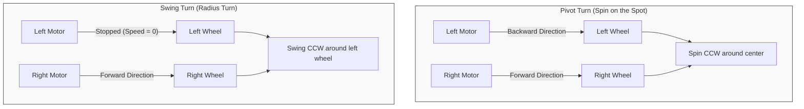
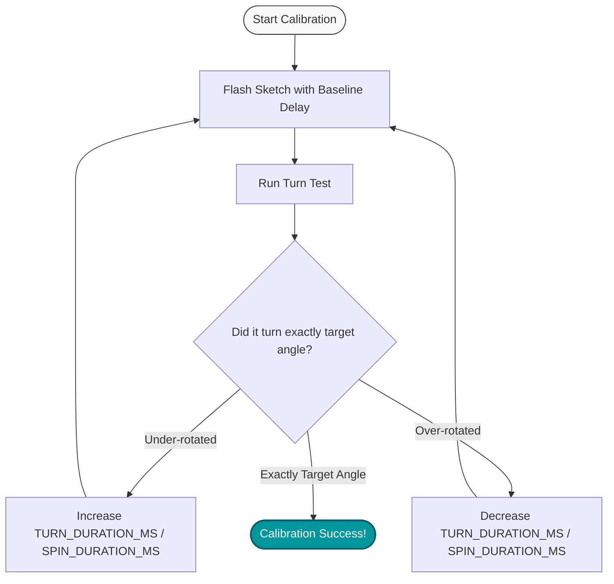

# 🧪 Experiment 02: Differential-Drive Turning Concepts

## 🎯 Objectives
1. Understand the difference between a **Pivot Turn (Spin on Spot)** and a **Swing Turn (Radius Turn)** on a differential-drive robot.
2. Implement Left, Right, and 360-degree turns using discrete Arduino sketches.
3. Learn how to calibrate turn angles in an open-loop system using motor speed and **timing delays**.

---

## 🛠️ Theoretical Background

On a differential-drive robot like the AlphaBot2, there is no steering wheel. Steering is achieved entirely by driving the left and right wheels at different speeds or in different directions.

### Pivot Turn vs. Swing Turn
The two primary configurations for turning are:

* **Pivot Turn (Zero Turning Radius)**: Left and right wheels spin in **opposite directions** at the same speed. The robot rotates around its center point, which is optimal for tight spaces like mazes.
* **Swing Turn (Radius Turn)**: One wheel is held **stationary (Speed = 0)** while the opposite wheel rotates forward. The robot sweeps in an arc around the stationary wheel.

---

## 🧭 Open-Loop Calibration Flow

Without encoders (which count wheel rotations) or a gyroscope (which measures angles), a robot cannot directly measure how many degrees it has turned. Instead, we calibrate turns using **time** and **speed**:

$$\text{Turning Angle} \propto \text{Motor Speed} \times \text{Duration (ms)}$$

---

## 📂 Experiment Subdirectories

This experiment consists of three separate Arduino sketches:

1. **[Left-Turn](file:///f:/AlphaBot2/R4Experiments/02-Turning-Concepts/Left-Turn/Left-Turn.ino)**: Calibrates a precise 90-degree left pivot turn.
2. **[Right-Turn](file:///f:/AlphaBot2/R4Experiments/02-Turning-Concepts/Right-Turn/Right-Turn.ino)**: Calibrates a precise 90-degree right pivot turn.
3. **[Spin-360](file:///f:/AlphaBot2/R4Experiments/02-Turning-Concepts/Spin-360/Spin-360.ino)**: Calibrates a complete 360-degree spin on the spot.

---

## 🧠 Turning Truth Table (Left vs. Right Motors)

| Target Turn | Left Motor Dir | Right Motor Dir | Left Speed | Right Speed | Action |
|:---|:---:|:---:|:---:|:---:|:---|
| **Left Pivot** | `Backward` | `Forward` | `Speed` | `Speed` | Spins counter-clockwise on spot |
| **Right Pivot** | `Forward` | `Backward` | `Speed` | `Speed` | Spins clockwise on spot |
| **Left Swing** | `Stopped` | `Forward` | `0` | `Speed` | Swings CCW around stationary left wheel |
| **Right Swing** | `Forward` | `Stopped` | `Speed` | `0` | Swings CW around stationary right wheel |

---

## 📝 Lab Procedure & Student Tasks

> [!IMPORTANT]
> The robot will execute the turn immediately upon boot/reset, run for the specified duration, stop, and then enter an idle state. You can monitor the status wirelessly or over serial. To run the test again, simply press the **RESET** button on the Arduino board.

### Task 1: Calibrating the 90-degree Left Pivot
1. Open the [Left-Turn](file:///f:/AlphaBot2/R4Experiments/02-Turning-Concepts/Left-Turn/Left-Turn.ino) sketch in the editor.
2. Connect your Arduino UNO R4 WiFi to your computer.
3. Make sure the board is set to `arduino:renesas_uno:unor4wifi` and the correct COM port is selected.
4. Upload the sketch.
5. Place the robot on a flat, clean surface. Mark its starting alignment.
6. Turn the power switch ON. The robot will execute a left pivot turn.
7. If it turns **less than 90 degrees**, increase `TURN_DURATION_MS` in the code.
8. If it over-rotates, decrease `TURN_DURATION_MS`.
9. Upload the updated code and iterate until the turn is exactly 90 degrees.

### Task 2: Calibrating the 90-degree Right Pivot
1. Open the [Right-Turn](file:///f:/AlphaBot2/R4Experiments/02-Turning-Concepts/Right-Turn/Right-Turn.ino) sketch.
2. Repeat the calibration process to find the exact `TURN_DURATION_MS` for a 90-degree right pivot.

> [!NOTE]
> Even at the same speed, the left and right motors might require slightly different durations due to gear friction and physical motor variances!

### Task 3: The 360-degree Spot Spin Challenge
1. Open the [Spin-360](file:///f:/AlphaBot2/R4Experiments/02-Turning-Concepts/Spin-360/Spin-360.ino) sketch.
2. Calibrate the delay `SPIN_DURATION_MS` until the robot completes exactly one full rotation and points back to its exact starting line.

---

## ❓ Post-Lab Questions for Students
1. Did your robot require the exact same duration for a 90-degree Left turn versus a 90-degree Right turn? Explain why they might differ.
2. What are the advantages of a **Pivot Turn** over a **Swing Turn** in a narrow maze track?
3. If battery voltage drops from 7.4V to 6.2V, what will happen to your calibrated 360-degree turn? How can a closed-loop system using a gyroscope or wheel encoders resolve this?
